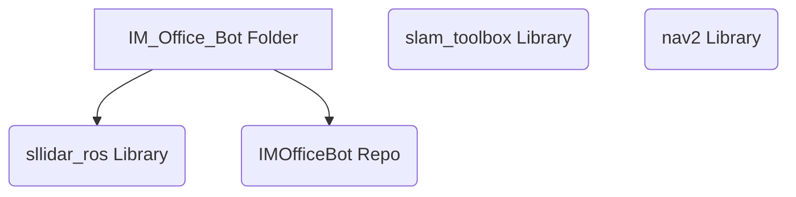
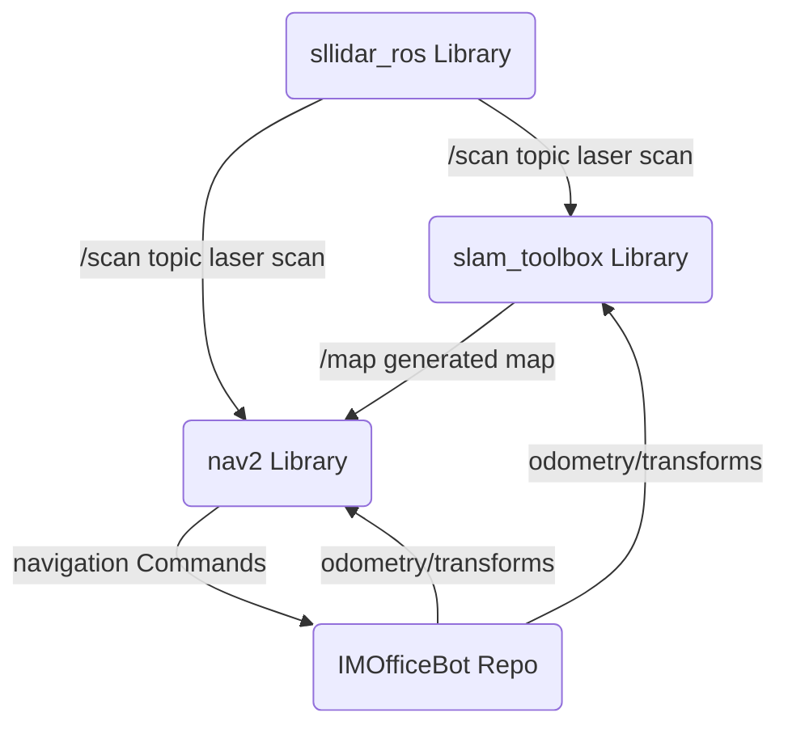

# ROS2 Template
This repo holds ROS2-based software to run a driving robot that maps and drives to locations.

The robot requires the sllidar_ros2 library to run the RPLidar, the slam_toolbox library for
mapping, and the nav2 library for navigation and obstacle avoidance.

Required library links:

https://github.com/Slamtec/sllidar_ros2

https://github.com/SteveMacenski/slam_toolbox

https://github.com/ros-navigation/navigation2

A setup process will be made later.

Lidar library -> Publishes to /scan, has other options as services

slam_toolbox -> listens to /scan and /tf and publishes /map, can save and load maps

nav2 -> listens to /tf (map -> odom), /scan, and /map to do navigation and obstacle avoidance

This Repo -> Broadcasts /tf, reads IMU, odometry, listens to nav and controls motors

# Packages in this Repo
## Core
This is the package for the modes of the robot.

This contains the mode node for high level operation of the robot, for this application it may be as simple as switching from map-based navigation, to keyboard controls.
## Controller
This is the package for all the controller code.
## Diagnostics
This is the package for all diagnostics code.
## Sensors
This is the package for all sensor drivers and nodes.

This includes a node for the mouse position sensor, the IMU, and an odometry node to publish the transformations of the robot based on the heading from teh IMU and the position sensing of the mouse sensor.
## Outputs
This is the package for system outputs like actuators, lights, etc.
## Message Types
This package defines custom messages used by the different nodes.

# File System and library Architecture
The nav2 and slam_toolbox libraries are installed separately while the IMOfficeBot Repo and the sllidar_ros library need to be built and sourced.

# Data Transfer between libraries

# Commands
Launch the IMOfficeBot Nodes (from in /IMOfficeBot):
ros2 launch launch/robot.launch.py

Launch Lidar Driver:
ros2 launch sllidar_ros2 sllidar_a1_launch.py

To visualize in RVIZ2 (on the RPi): ros2 launch sllidar_ros2 view_sllidar_a1_launch.py

Launch slam_toolbox
ros2 launch slam_toolbox online_sync_launch.py base_frame:=base_link

To save the map generated by the slam_toolbox as a .pgm (with a yaml for meta data):
ros2 run nav2_map_server map_saver_cli -f \<map-name\>

Launch Nav2 stack
ros2 launch nav2_bringup navigation_launch.py

